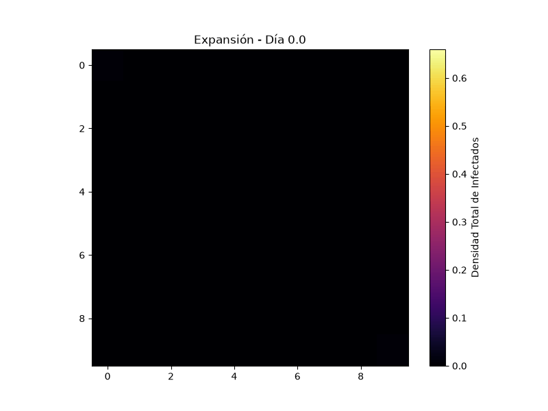
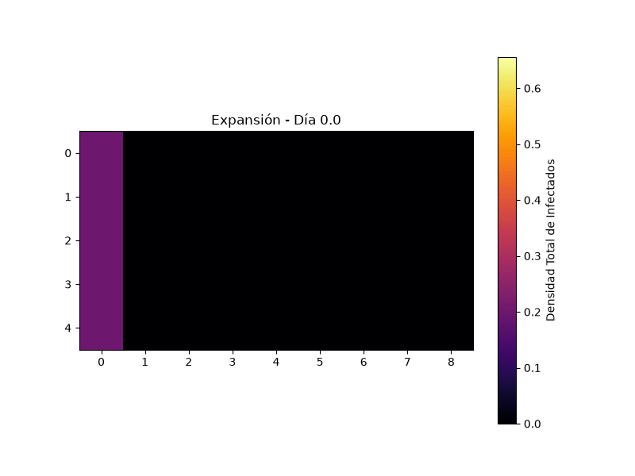

# Modelo multicepa de dengue con estructura espacial

**Abstract.** A spatially-explicit compartmental model for dengue transmission with
`c` co-circulating serotypes and `n` coupled spatial patches, generalizing the
single-patch, four-serotype model of de Araújo et al. (2023) to an arbitrary
network of patches. The implementation is validated by a 39-test suite that checks
the model's algebraic conservation identities, invariants, symmetries, and a known
epidemiological threshold directly against the equations — not just against a
frozen regression snapshot — plus a mutation-testing pass that confirms the suite
actually detects broken indices and signs.

---

## 1. Qué es

Este repositorio implementa numéricamente un modelo compartimental de transmisión de
dengue con **`c` serotipos** y **`n` parches espaciales acoplados**. Es una
generalización del modelo de un solo parche y cuatro serotipos de:

> de Araújo RGS, Jorge DCP, Dorn RC, Cruz-Pacheco G, Esteva MLM, Pinho STR.
> *"Applying a multi-strain dengue model to epidemics data."*
> Mathematical Biosciences. 2023;360:109013.
> DOI: [10.1016/j.mbs.2023.109013](https://doi.org/10.1016/j.mbs.2023.109013)

Ese paper tiene 25 EDOs y un solo parche; acá hay 25 EDOs *por parche*, acopladas
por una red espacial de primeros vecinos.

## 2. Contexto

Este trabajo surge del proyecto **"Estudio de modelos matemáticos estructurados para
la transmisión del dengue"** (Beca de Ayudantía de Investigación UNRC-ODS,
Departamento de Matemática, Universidad Nacional de Río Cuarto, Argentina), dentro
del proyecto marco *"Problemas teóricos en ecuaciones diferenciales y cálculo de
variaciones"*, dirigido por Fernando Mazzone.

**Autor:** Teo Demergasso.

## 3. Demostración



Escenario "Choque de Ondas": dos serotipos sembrados en esquinas opuestas de una
grilla de 10×10 nodos, chocando en el centro (`run.py --nodos 100 --cepas 2
--escenario 1 --t-final 90 --salida docs/demo.gif`). El GIF de arriba tiene la
mitad de los cuadros de la simulación real (150 de 300), solo para bajar el tamaño
del archivo — la integración en sí usa siempre los 300 puntos de muestreo.

## 4. Instalación y uso

```bash
python -m venv .venv
.venv\Scripts\activate          # Windows; en Linux/Mac: source .venv/bin/activate
pip install -r requirements.txt

python run.py --nodos 100 --cepas 2 --escenario 3
```

Ese comando corre en menos de 2 segundos (medido) y abre una ventana con la
animación. Ver todas las opciones con `python run.py --help`, en particular
`--escenario` (incluye `0`, estado libre de enfermedad), `--sigma` para el efecto
cruzado entre serotipos, `--salida` para guardar un GIF, y `--sparse` para la ruta
de acoplamiento disperso (sección 6).

Escenarios disponibles (`--escenario`):

| # | Nombre | Qué pregunta responde |
|---|---|---|
| 0 | Estado limpio | Punto de partida sin siembra, para sembrar a mano. |
| 1 | Choque de ondas | Dos serotipos en esquinas opuestas: ¿se preserva la simetría? (T9) |
| 2 | Cortafuegos | Pared de recuperados del serotipo 1, solo ese serotipo sembrado. La pared retrasa unos días pero no aísla: el frente cruza por los mosquitos de la pared. |
| 3 | Siembra estocástica | Focos aleatorios con semilla fija (default; caso del golden T10). |
| 4 | Reservorio | Misma pared que el 2 con **ambos** serotipos sembrados: la pared amplifica al serotipo 2 (sección 7). Requiere `--cepas >= 2`. |
| 5 | Control del reservorio | Idéntico al 4 sin la pared. Requiere `--cepas >= 2`. |

El resultado central del documento (escenarios 4 vs 5) se reproduce con un comando:

```bash
python scripts/reproducir_reservorio.py
```

## 5. Verificación

El repositorio tiene una suite de 48 tests (`pytest`, corre en unos 6 segundos) que
funciona como red de seguridad: si alguien rompe un índice, un signo, o un eje de un
`einsum`, algún test tiene que fallar. Se verificó esto con un **testeo por
mutación**: se introdujeron 10 errores deliberados en el modelo (un índice
transpuesto, un signo faltante, un eje de suma equivocado, etc.) y se corrió la
suite contra cada uno.

| Test | Propiedad matemática que garantiza |
|---|---|
| T1 | `MapeoInv(Mapeo(...))` devuelve exactamente los arrays originales (ida y vuelta del aplanado, incluida la convención de orden Fortran). |
| T2 | Identidad de conservación puntual sobre el lado derecho de las EDOs, total y por cepa primaria — el test más sensible a errores de índice. |
| T3 | Conservación integrada a lo largo de una trayectoria completa, vía un acumulador de flujo como estado extra. |
| T4 | Positividad: ningún compartimento se vuelve negativo. |
| T5 | La población de mosquitos infectados por parche nunca supera 1. |
| T6 | Con acoplamiento nulo, la infección no cruza a otros parches; con una red dirigida a mano, tampoco viaja en contra del sentido del acoplamiento. |
| T7 | Con una sola cepa, la infección secundaria es idénticamente cero y la dinámica coincide con un SIR-vector de referencia escrito aparte. |
| T8 | Umbral epidémico: con R₀ < 1 la infección decae, con R₀ > 1 crece a la tasa predicha por el autovalor dominante de la linealización. |
| T9 | Simetría de rotación de 180° del escenario "Choque de Ondas" entre las dos cepas. |
| T10 | Regresión: el estado final de un caso determinista coincide con un golden generado antes de cualquier refactor. |

**Resultado del testeo por mutación:** 9 de las 10 mutaciones fueron detectadas por
la suite, la mayoría en menos de 5 segundos. La mutación no detectada (invertir el
orden de índices al construir la red de vecinos) resultó ser un **mutante
equivalente**: la grilla de vecinos no es dirigida, así que esa mutación produce
exactamente la misma matriz. La convención de índices que sí importa (la del
`einsum` del modelo, no la de la construcción de la red) está cubierta por un test
con una red *deliberadamente* dirigida, construida a mano.

La Sesión B de refactor agregó dos tests más (no parte del contrato original, ver
sección 6) que comparan la ruta de acoplamiento disperso contra la densa a `1e-10`, y
la Sesión D otros nueve (`tests/test_reservorio.py`): la estructura de los escenarios
4 y 5, un golden propio del escenario 4, y la afirmación central del documento como
test falsable (con pared el serotipo 2 supera en más del 10 % al control sin pared,
para `σ = 1,5` y `σ = 0,5`). Total: 48 tests en unos 6 segundos.

## 6. Rendimiento: acoplamiento denso vs. disperso

La construcción de la red (`build_network`) arma matrices `lam`/`delta` de forma
`(n, c, n)` densas, aunque cada nodo solo tiene ~5 vecinos no nulos. Para `n`
grande eso es memoria y cómputo desperdiciados: cada evaluación del lado derecho
cuesta `O(n²·c)` en vez de `O(n·c)`.

`--sparse` activa una ruta alternativa (`dengue/sparse.py`) que representa el
acoplamiento con `scipy.sparse.csr_matrix` en vez de arrays densos. Es **opt-in**,
no reemplaza a la ruta densa: el golden de regresión y los demás tests siguen
usando exclusivamente la ruta densa, y ambas coinciden a `1e-10` (no bit a bit —
sumar en otro orden cambia los últimos bits).

Benchmark medido (`c = 2`, tiempo por evaluación del lado derecho, no integración
completa):

| `n` | Memoria (`lam`+`delta`) | Tiempo por evaluación | Speedup |
|---|---|---|---|
| 400 | 5.1 MB → 0.05 MB | 1.509 ms → 0.340 ms | 4.4× |
| 2500 | 200 MB → 0.32 MB | 30.6 ms → 0.629 ms | 48.8× |

El speedup crece con `n` porque la ruta densa es `O(n²)` y la dispersa `O(n)`; a
`n = 400` el beneficio ya es notorio y a `n = 2500` es determinante.

## 7. Limitaciones conocidas

- **Efecto de borde sin normalizar.** La fuerza entrante total es
  `β·(1 + k·coupling)` con `k = 4` en el interior de la grilla, `3` en los bordes y
  `2` en las esquinas. El frente de onda se deforma al llegar al borde por esta
  razón artificial, no por una propiedad epidemiológica.
- **`σ = 1.5` por defecto: régimen de *enhancement* (ADE).** La infección primaria
  facilita la secundaria en vez de proteger contra ella. Cualquier resultado con los
  parámetros por defecto debe leerse en ese régimen; `--sigma` permite cambiarlo.
- **La pared de inmunidad no aísla, y no por la razón que uno esperaría.** El
  escenario 2 pone una pared de recuperados del serotipo 1 frente a un brote de ese
  mismo serotipo: la pared retrasa el frente unos días pero no lo bloquea, porque los
  mosquitos de la pared se infectan de los humanos vecinos y transmiten al otro lado
  (la barrera es de hospedadores, no de vector). Cuando circula además un segundo
  serotipo (escenario 4), la pared se convierte en un reservorio de hospedadores que
  le llega intacto al serotipo 2 y lo amplifica, en los dos regímenes de `σ`. Con la
  grilla 5×9 y `c = 2` (`python scripts/reproducir_reservorio.py`):

  | Configuración | Pico serotipo 2, mitad derecha | Pico en la pared |
  |---|---|---|
  | σ=1,5 con pared (esc. 4) | 0,46 | 0,53 |
  | σ=1,5 sin pared (esc. 5) | 0,33 | — |
  | σ=0,5 con pared (esc. 4) | 0,40 | 0,34 |
  | σ=0,5 sin pared (esc. 5) | 0,27 | — |

  Es el resultado central de la sección 1.3 del documento LaTeX (`docs/Estudio.tex`)
  y está cubierto por un test (`tests/test_reservorio.py`): con pared > sin pared para
  ambos `σ`. No es un bug — es un resultado del modelo.

  

  *Escenario 4 en la grilla 5×9 (`python run.py --nodos 45 --cepas 2 --escenario 4
  --t-final 60 --salida docs/reservorio.gif`, diezmado a la mitad de los cuadros para
  el tamaño del archivo). Compárese con el escenario 2, donde la pared queda oscura.*
- **Sin forzado estacional.** Los parámetros de transmisión son constantes en el
  tiempo; el modelo no captura la estacionalidad del vector.
- **No calibrado contra datos reales.** Los parámetros por defecto son los del
  paper de referencia, no un ajuste a una serie epidemiológica concreta.
- **Presupuesto de evaluaciones en los tests.** El helper `integrar` de la suite
  corta la integración después de 200 000 evaluaciones del lado derecho (~50× lo
  que usa una corrida sana) para que un modelo roto falle rápido en vez de colgar
  el integrador. Es una salvaguarda de los tests, no un límite del modelo en sí.
- **Acoplamiento `lam`/`delta` formalmente independientes**, aunque describen el
  mismo patrón de encuentro humano-mosquito — genera parámetros no identificables
  a partir de datos.

## 8. Símbolos: TEX ↔ Python ↔ forma

Convención de índices: `l, m` recorren parches (`0..n-1`), `i, j` recorren
serotipos (`0..c-1`). `Y[l,i,j]`: infección primaria por `i`, secundaria por `j`.

| Símbolo TEX | Variable Python | Forma | Significado |
|---|---|---|---|
| $S_l$ | `S` | `(n,)` | Humanos susceptibles a todos los serotipos |
| $I_{li}$ | `I` | `(n, c)` | Infección primaria por serotipo `i` |
| $Z_{li}$ | `Z` | `(n, c)` | Recuperados de infección primaria por `i`, susceptibles al resto |
| $Y_{lij}$ | `Y` | `(n, c, c)` | Infección secundaria: primaria por `i`, secundaria por `j` |
| $V_{li}$ | `V` | `(n, c)` | Mosquitos infectados por serotipo `i` |
| $\lambda_{lim}$ | `lam` | `(n, c, n)` | Fuerza de infección sobre humanos de `l` ejercida por mosquitos de `m`, cepa `i` |
| $\delta_{lim}$ | `delta` | `(n, c, n)` | Infección de mosquitos de `l` por humanos de `m`, cepa `i` |
| $\sigma_{ij}$ | `sigma` | `(c, c)` | Efecto cruzado: primaria `i` → secundaria `j` (`> 1` es *enhancement*/ADE) |

## 9. Estructura del repositorio

```
dengue/
  model.py      Dimensiones, Mapeo, MapeoInv, Modelo (núcleo dinámico)
  network.py    geometría de grilla, build_network, sigma_default
  scenarios.py  condiciones_iniciales por escenario
  sparse.py     ruta de acoplamiento disperso opt-in (--sparse)
run.py          punto de entrada de línea de comandos
scripts/
  reproducir_reservorio.py   regenera la tabla del efecto de reservorio (escenarios 4 vs 5)
tests/          suite de verificación (ver tests/README.md)
docs/           Estudio.tex (documento LaTeX), demo.gif
HALLAZGOS.md    decisiones y hallazgos de cada sesión (no versionado)
```

## 10. Licencia

MIT, ver [LICENSE](LICENSE).
